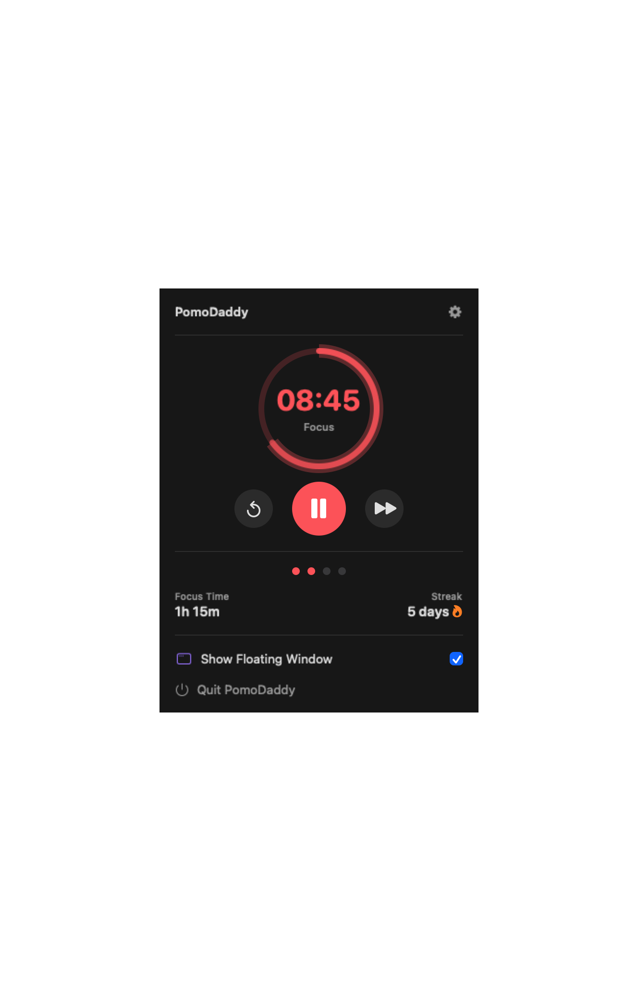
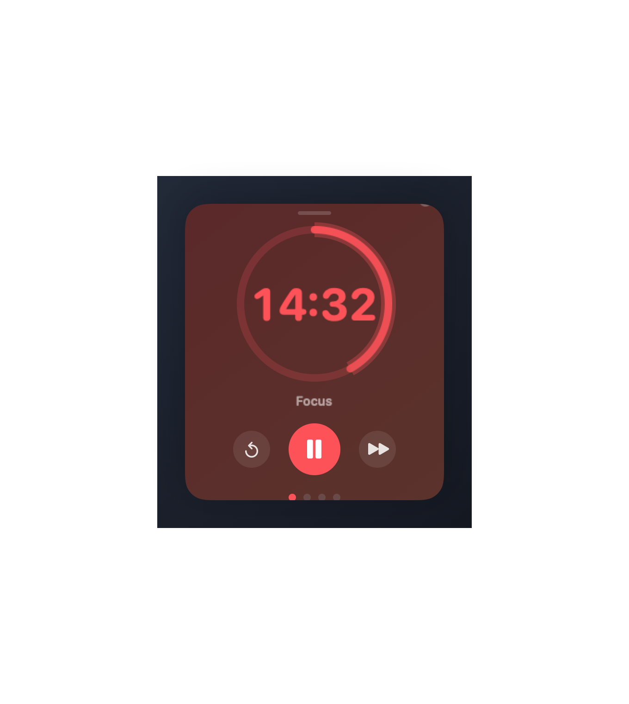
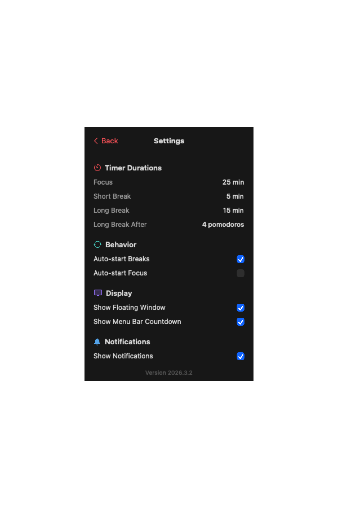

<p align="center">
  
</p>

<h1 align="center">PomoDaddy</h1>

<p align="center">
  <strong>Your Mac's favorite Pomodoro timer. Lives in the menu bar. Doesn't judge your browsing habits.</strong>
</p>

<p align="center">
  <a href="https://www.apple.com/macos/"></a>
  <a href="https://swift.org/"></a>
  <a href="https://github.com/nkrebs13/PomoDaddy/actions/workflows/ci.yml"></a>
  <a href="LICENSE"></a>
</p>

<table align="center">
  <tr>
    <td align="center"><strong>Menu Bar Popover</strong></td>
    <td align="center"><strong>Floating Window</strong></td>
  </tr>
  <tr>
    <td></td>
    <td></td>
  </tr>
  <tr>
    <td align="center" colspan="2"><strong>Settings</strong></td>
  </tr>
  <tr>
    <td align="center" colspan="2"></td>
  </tr>
</table>

---

## What is this?

PomoDaddy is a lightweight macOS Pomodoro timer that sits in your menu bar and keeps you honest about your focus time. It's got a floating window, confetti when you finish a session, and zero telemetry. All your data stays on your Mac.

## Install

```bash
brew tap nkrebs13/tap
brew install --cask pomodaddy
```

Or grab the `.dmg` from [Releases](https://github.com/nkrebs13/PomoDaddy/releases).

## Features

- **Menu bar timer** with a progress ring that fills as you work
- **Floating window** that stays on top and remembers its position
- **Customizable intervals** (default: 25/5/15 Pomodoro technique)
- **Stats tracking** with daily totals, weekly trends, and streaks
- **Confetti** when you complete a session (because you earned it)
- **Full VoiceOver support** for accessibility
- **Zero network requests** — your data never leaves your Mac

## Quick Start

1. Launch PomoDaddy
2. Click the tomato in your menu bar
3. Hit play
4. Get stuff done

## Build from Source

```bash
git clone https://github.com/nkrebs13/PomoDaddy.git
cd PomoDaddy
make setup   # installs xcodegen, generates project
make build   # builds the app
```

## Docs

- [Architecture](docs/architecture.md) — how it's built
- [Building & Distribution](docs/building.md) — signing, notarization, DMG creation
- [Contributing](CONTRIBUTING.md) — development setup and guidelines

## Privacy

All data is stored locally via SwiftData. No network requests. No analytics. No telemetry. [Full privacy policy](PRIVACY.md).

## License

MIT — see [LICENSE](LICENSE).

---

<p align="center">
  <sub>Built with SwiftUI, SwiftData, and mass quantities of coffee by <a href="https://github.com/nkrebs13">Nathan Krebs</a></sub>
</p>
